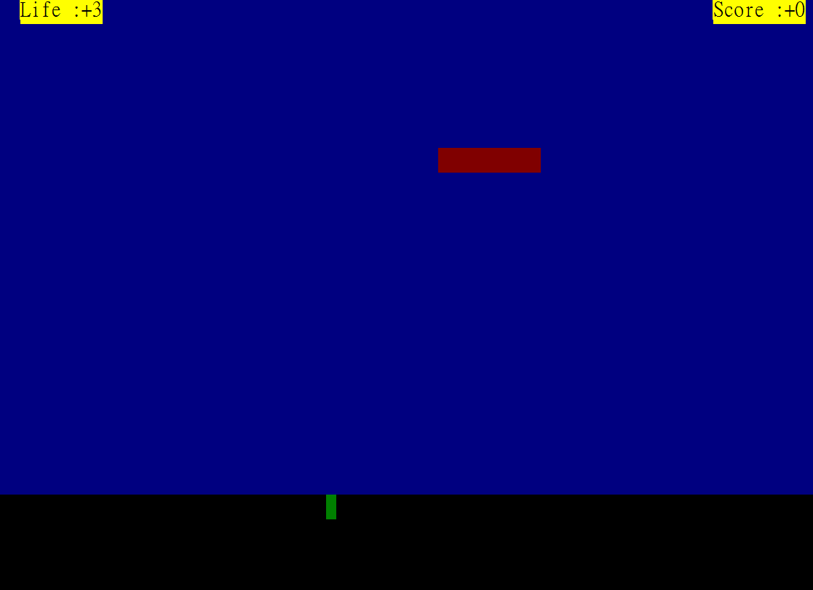
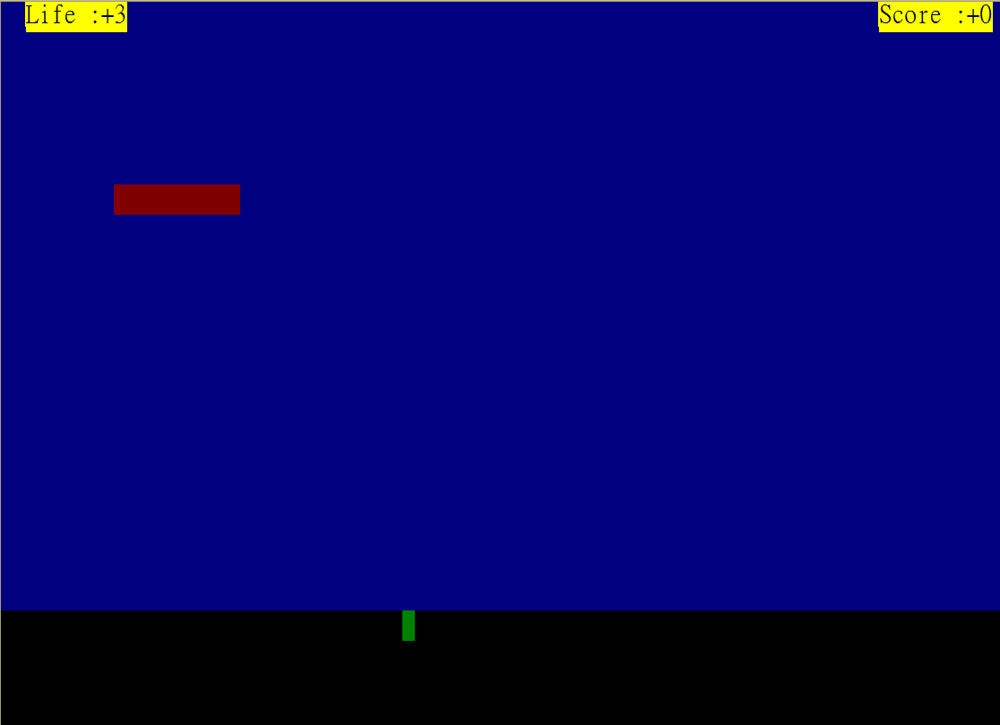
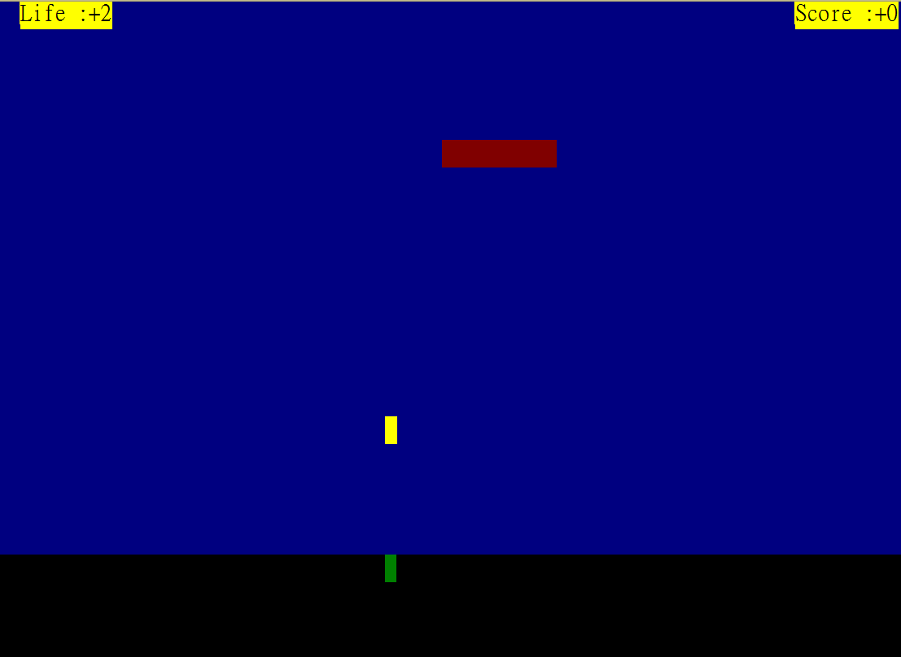
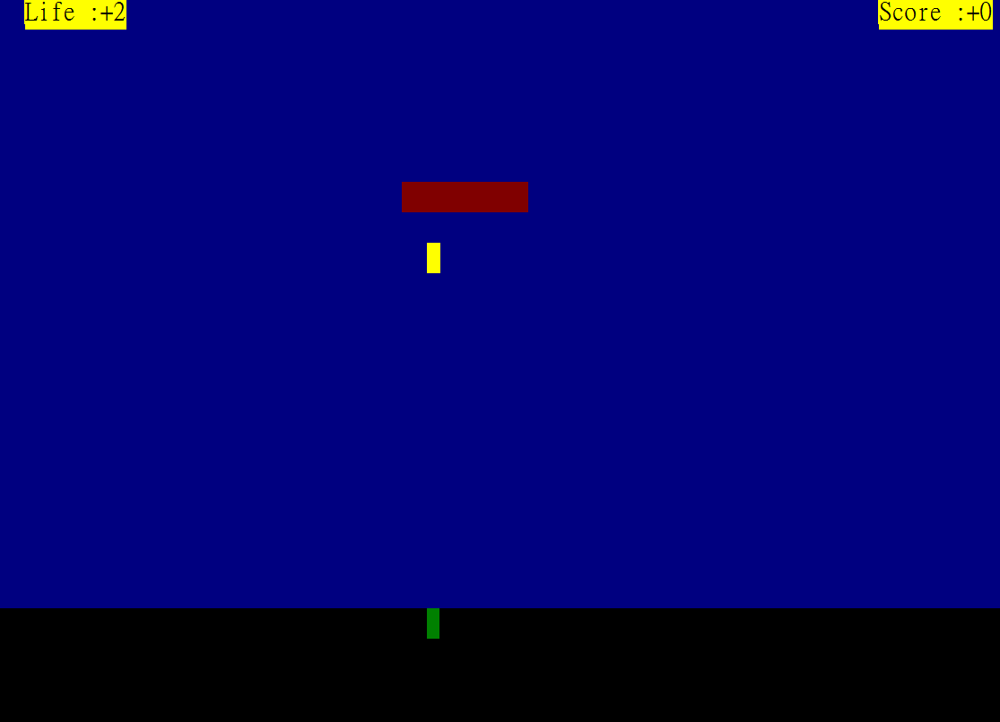

## Space Shooting Game
Space shooting game in command-prompt implemented using x86 assembly language and Irvine32 link library.

Player can move, fire at enemy spaceships, pause/resume game, and configure spaceship size.

Win if shooting down enemy spaceships three times; lose if they escape five times.

## Command
Key | Function
:-:|:-:
F | Move left
H | Move right
Space | Fire bullet
P | Pause/Resume game
Esc | Quit game

## How to Run
Extract `Irvine.zip` to `C:`.

Open .sln file with Microsoft Visual Studio Community 2019.

Start Without Debugging in Debug&Win32 mode.

## Screenshots
### Enemy spaceship floating.

### Firing bullet.

## Note
Don't use chinese character in .asm file name.
